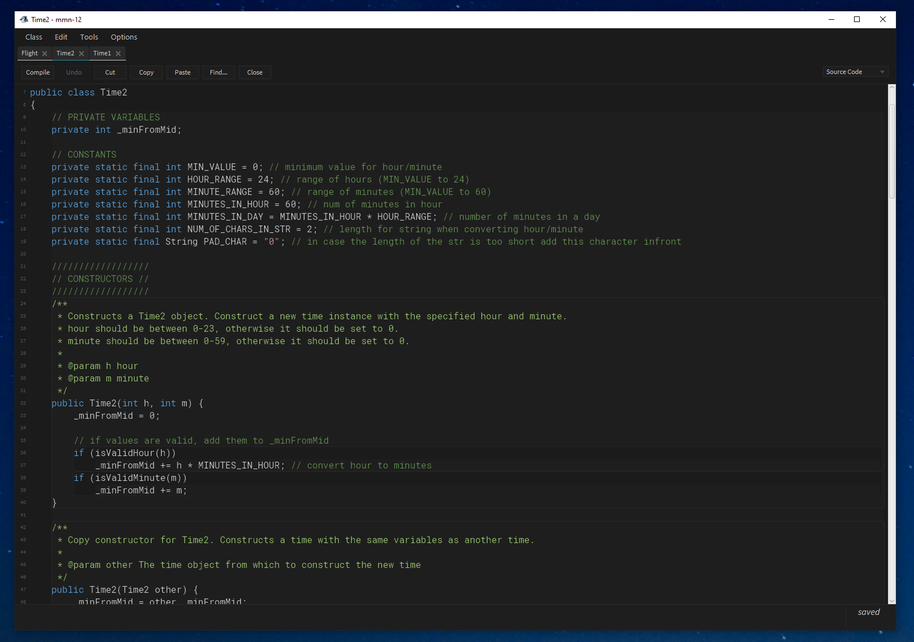
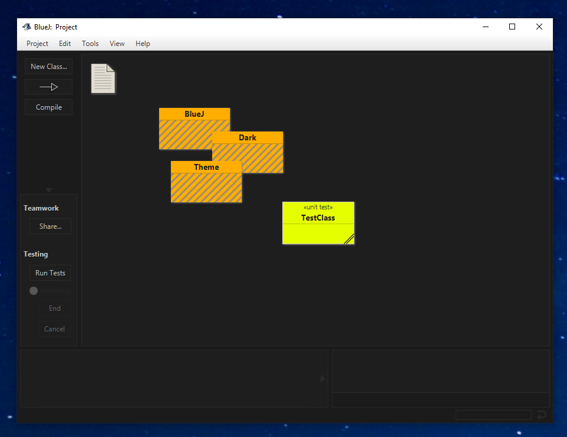

# VS Dark theme for BlueJ
A nice (possibly the nicest) looking dark theme for BlueJ.

## Installation
Replace all files in your `BlueJ/lib/stylesheets` with the css files found in the [`stylesheets`](stylesheets/) directory.

* **On Windows** the `BlueJ` root directory should be located at `"C:\Program Files\BlueJ\"`.

## Screenshots

## Copyright
This theme was created by Beery Shklar and licensed under the [GPL-V3](LICENSE) license.
